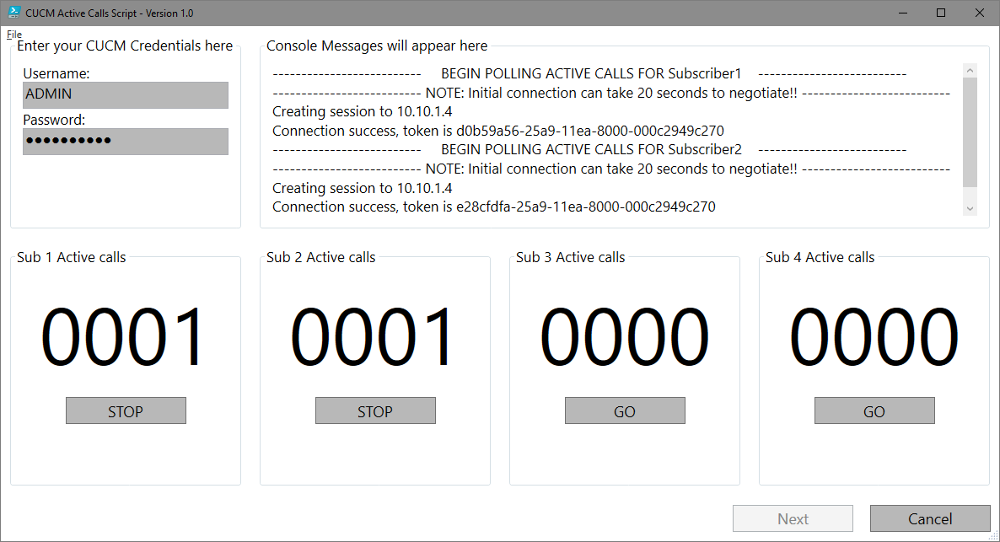

# CUCM Powershell script examples

A collection of PowerShell scripts that demonstrate using REST and SOAP to interface with CUCM.

### Scripts

**CucmActiveCalls.ps1** - Script that creates a real time season to each CUCM subscriber, then displays the active calls. For more information about the Performance Monitor API (which this script accesses), Google the term **cucm perfmon api devnet**.
Change lines 72 to 75 in the script to the IP addresses for up to four CUCM servers executing the Call Manager service.

## Installation

Click on the link for the script above. When the PowerShell code page appears click the **Download Raw file** button top right. Once downloaded to your computer have a read of the script in your prefered editor. All the information for executing the script will be in the script synopsis.

## Credits and references

#### [AXL API with SOAPUI and Powershell](https://www.youtube.com/watch?v=tb9hINfg2nY&list=LL&index=10&t=421s)
A really great guide about how to get started sending AXL requests. Totaly recomend this video.

----
